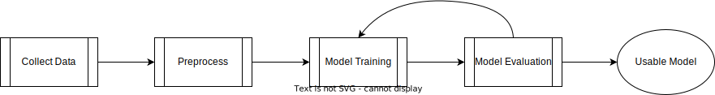
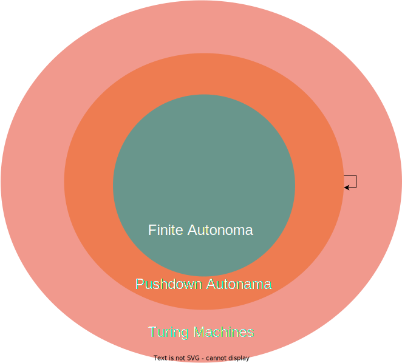

# Capabilities and Limitations of ChatGPT: A Realistic Perspective

Unless you've been living under a rock, you've probably heard of ChatGPT, the AI wonder child that generates text and has conversations on a seemingly human level. Maybe you're even a user of it yourself. It's all the rage on social and traditional media, and no wonder! It is an incredible and extremely useful technological achievement. I use ChatGPT myself on a daily basis, both personally and professionally.

When asked to [write a short story](https://chat.openai.com/share/1c284f0b-357d-44f5-aee0-44fe9dcec054) about fishing in the style of Oscar Wilde, ChatGPT immediately spins a fascinating tale about Finbar O'Finnegan's whimsical quest to catch the fabled golden trout.

> Once upon a time in the small, picturesque town of Ballybrack, Ireland, there lived an eccentric gentleman named Finbar O'Finnegan. Finbar was noted for his curious, flamboyant hats and an obsession with fishing which surpassed the normal passions of his compatriots. Unlike most who fished for a livelihood or supper, Finbar had a singular, whimsical motive: to catch the elusive Golden Trout of Ballybrack...

It can [explain advanced physics](https://chat.openai.com/share/66c94683-d41b-46ef-a7f9-22e1b5017190), such as when asked how the properties of a Bose-Einstein condensate and a Fermionic condensate differ.

> Bose-Einstein condensates and Fermionic condensates are both special states of matter that arise at extremely low temperatures, but they arise from different types of particles and exhibit different properties as a result...

It can even write code (to a certain extent). When asked to [write a Python program](https://chat.openai.com/share/2bcd560f-68c3-434c-91be-0f639c051768) that determines whether a string is a valid regular expression, it happily complies (in my test, it got it right on the second attempt).

But with such an impressive technology has come no small amount of anxiety. In my view, the risks associated with AI are not only among the most serious of our time but in the entire history of humanity. To say that it warrants our attention would be a gross understatement. At the same time, to properly respond to the risks, we need an accurate understanding of the current state of AI, what it is and isn't capable of, and how it's likely to develop in the near and far-term. Otherwise, we will put our attention and our resources in the wrong place and fail to solve the actual problems, and create new problems by deploying the technology in roles that it is not suitable for.

Part of the problem is that, with all the attention and furor that ChatGPT has received, many of the people commenting on it don't have any actual expertise in AI, and this has created a general misunderstanding of what it is (and isn't) capable of. As impressive as this technology is, it is not magic. So in this article, we're going to explore some of the underlying science behind how large language models like ChatGPT work and what this tells us about their capabilities to hopefully untangle some of the confusion.

## Understanding the Science Behind How ChatGPT Works

Let's start by going over the basic process for how a large language model like ChatGPT is created. Unlike traditional computer programs, machine learning models aren't explicitly coded by software developers; rather, they are _trained_ on a set of data. So for the first step in the process, we need to collect some data. In the case of large language models, since we want to train a model that generates text, this data consists of books, articles, social media posts, and other bodies of text that have been written by humans. Since the model is based on data, the more data we have, the more capable the model will be (up to a point).

The next step is to get the data into a form that the model can understand - most types of models can't understand most types of data, so we have to convert the data from our language into a language that the model can understand. This is called _preprocessing_.

Then we actually train the model on the data[^1^]. This consists of many repetitions of feeding part of the text to the model, checking whether it predicted the rest of the text accurately or not, and adjusting the parameters of the model whenever it makes a mistake. Of course, this would be infeasible to do by hand because there is multiple terabytes of data, hundreds of millions of parameters in the model, and many thousands or millions of training repetitions, so we automate the process using software.

At this point, even if we've followed the process correctly, there is no guarantee that we will have a useful model. Quite often, the model will just memorize the training data instead of actually learning the underlying rules, or learn the wrong thing, or otherwise not behave in the way that we want. So we extensively test and evaluate the model on unseen data (i.e., data that it wasn't trained on) and usually retrain the model multiple times again, adjusting our training criteria and fine-tuning the model's architecture and parameters[^2^] until finally (hopefully) it does what we want.

Next, we have to actually apply the model to make a prediction; this step is called "inference". In the case of a large language model, this involves giving the model an incomplete string of text as input so that it will do what it was trained to do - complete the text.

Now, if you've spent time using ChatGPT, you may be thinking that the way I've described the inference step doesn't look very much like what ChatGPT does - you ask ChatGPT a question, and it supplies you with an answer. But actually, ChatGPT's "answer" is just its attempt to complete the text by predicting what characters should come after your question.

We can easily demonstrate this with an example. Given the text "O say, can you see," ChatGPT simply completes the lyrics to the rest of the song, as you can see [here](https://chat.openai.com/share/d87f4233-60a4-4280-ba3f-c2a98ed0c6ad).

One thing to note is that training and inference are separate steps. In other words, using the model to make an inference doesn't change the model in any way; changes to the model only occur during the training step. The model is trained, and then it is repeatedly applied to make inferences.

## The Laws of Computation

There are many ways in which this type of model is limited, but perhaps the greatest limitation has to do with computability. To understand this limitation, we first need to understand a little bit about computer science. Despite what the name implies, computer science actually has nothing to do with computers as we commonly think of them. Rather, computer science is the study of _computation_. So what is computation?

Say that we want to build a shelf. What steps would we follow to solve this problem? Well, first we need to go to the store to buy some materials - wood, screws, paint, sandpaper, etc. Then we need to make sure we have the right tools - if we already have tools from a previous woodworking project, then we can reuse them; otherwise, we need to acquire some tools. Then we use our saw to cut the wood to the right dimensions. And so on and so forth until we have a shelf.

What I've just described is an _algorithm_ - a sequence of instructions - for building a shelf. A computation is just the process of working through the steps of an algorithm. This may seem like a strange way to think about building a shelf, but consider a robot that consists of a computer and all of the machinery and components that it needs to do woodworking, and a computer program - an algorithm - that tells it how to build a shelf. It doesn't matter whether it's a robot following the algorithm or a human following the algorithm; the process is every bit as much a computation in either case.

There is a close relationship between computation and reasoning. Scientists and philosophers are split on whether they are actually the same thing or not, but at a minimum, the ability to carry out computations is very important for the ability to reason, especially for forms of reasoning where we can explain precisely how we arrived at our conclusion (e.g., deductive reasoning and most forms of inductive reasoning).

One of the most interesting things about computation is that there are laws of computation, like the laws of physics, that describe what is and isn't possible. One of these laws relates to the class of problems that can be solved by different categories of abstract machines. By "abstract machine," what I mean is that these aren't literal machines, like a desktop computer or a Roomba, that actually exist in reality, but rather a kind of thought experiment that organizes computations into different classes. These classes are hierarchical, meaning that a machine from a higher class can solve all the problems that a machine from a lower class can, but not vice versa.

On a very high level, we can organize these machines into three different classes (from lowest to highest): finite automata, pushdown automata, and Turing machines[^3^]. So, pushdown automata can solve all of the problems that finite automata can, and Turing machines can solve all of the problems that both pushdown automata and finite automata can, but finite automata can't solve problems in the pushdown automata or Turing machine classes, and pushdown automata can't solve problems from the Turing machine class[^4^]. This idea is known as _computational power_.

All systems that have the ability to do computations can be classified according to their computational power, and this includes large language models like ChatGPT. So what computational class do large language models fall into? They are actually in the weakest class - finite automata. This may surprise you because it certainly seems like these systems can solve quite complex problems. But that is because they're not truly "solving" them - they're making statistical inferences based on the data they've been trained on (i.e., problems that humans have solved in the past) about what character should come next in the sentence that makes their response most like what they've seen in the past.

This approach works great when you're faced with a problem that has already been solved, and you just don't know what the solution is (e.g., you have a question about the current state of physics). But when you have a problem that requires actual _reasoning_ to solve it (i.e., computation), this doesn't work so well.

## Illustrating the Limitations

Let's look at a few examples. Say that we have a sequence of ten words that are all just combinations of three different words - "foo," "bar," and "baz." We can combine these words in any order, and our task is to determine whether or not the combination forms a palindrome (a sequence that is the same both forwards and backwards). For example, the following sequence is a palindrome:

foo bar baz bar bar bar bar baz bar foo

And this sequence is not:

foo bar baz bar bar baz bar foo foo bar

We humans can easily solve this problem. All that you need to do is write the words in reverse order and see if they match. For the first example I gave, the reverse ordering would be:

foo bar baz bar bar bar bar baz bar foo

Exactly the same as the original sequence. So, this is a palindrome. Here is the second example that I gave in reverse order:

bar foo foo bar baz bar bar baz bar foo

Clearly not the same as the original sequence.

Can ChatGPT solve this simple problem of determining what sequences form a palindrome? No, it cannot. To test this, I gave ChatGPT (GPT-4) a list of 100 sequences of words and [asked it to classify each of them](https://chat.openai.com/share/f36aae93-c6a8-4ea7-b123-29c74849c111) according to whether they were a word-level palindrome or not. It got 49/100 correct - exactly the same as randomly guessing[^5^].

Actually, it was substantially worse than this. The first time I gave it the list, it gave me back 150 classifications (out of 100 sequences), so I had to split the list into chunks of 25 and do it again. This time it gave me back the correct number of responses, but for each chunk, it responded with either all yes or all no - in other words, it resoundingly failed to solve the problem. And this is exactly what we would expect from the laws of computation because this is a problem that requires the computational power of at least a pushdown automaton to solve, and these models do not have that.

Let's look at one more example, a simple math problem:

10 * (1 + 4 + 6 + (10 - 1 / 10) / 10 + (1 - 2)) + 100

This expression has a moderate amount of operations in it, but if we remember the rules we were taught in grade school and take it one step at a time, we can easily solve it. The answer is 209.9.

Now, ChatGPT (at least GPT-4) actually can solve this problem, sort of. The reason I say "sort of" is that its ability is unstable - we can very easily turn it into a problem that it can't solve, like so:

10 * (1 + 4 + 6 + (10 - 1 / 10)) / 10 + (1 - 2)) + 100

Notice that I've added a stray parenthesis to the part of the expression at `(10 - 1 / 10))`. Now the expression is ill-formed and ambiguous. It has no solution because it's not properly formed. A human can easily recognize this and determine that we can't give a meaningful answer because the rules of math are not defined in this case.

However, when I [gave this problem to ChatGPT](https://chat.openai.com/share/2f8ad09a-7419-4860-b879-fa3334330dfd), even though I instructed it not to give an answer if there was a problem with the expression, it happily churned out 119.9, completely oblivious to the stray parenthesis - just as we would predict from first principles.

## Realistic Expectations and Potential Impact

Hopefully, this drives home the point that ChatGPT cannot actually reason about things. It presents the illusion of reasoning (in some cases) because it is taking examples of human reasoning and interpolating them. But it doesn't actually _understand_ the problems or the solutions that it's giving. This has profound implications for the types of problems that it can reliably solve.

One of the common refrains that I've heard is that large language models will lead to exponential growth in AI capabilities. The argument goes something like "they will enable scientists and developers to create more powerful AI systems, which will enable them to create even more powerful AI systems, ad infinitum, forming a positive feedback loop."

But this argument is missing a few things. First, it assumes that the capabilities of our models can expand without limit, which we know, according to the laws of computation, is not correct. No matter how large the models become or how much data there is available to train them on, it will not increase their actual computational power. That doesn't mean that it won't increase their capabilities (up to a point), but it will never enable them to reason; no matter how big they become, that will always be a limitation that these models have.

To get past this limitation, we need fundamentally different architectures for our models, and this requires new breakthroughs in the underlying science. It's not merely an engineering problem; these are problems with the state of the science itself, and we cannot solve them simply by interpolating on previous solutions. This is the frontier. It will take novel ideas to move it forward. Large language models don't have the ability to solve truly novel problems, and conferring that ability to them will require solving these problems - it's a chicken and egg situation. That's one reason why the exponential growth hypothesis is very unlikely to be correct.

Another common worry is that AI will displace human workers from their jobs. This is a serious concern - AI is already capable of doing some jobs that humans are doing, and it will likely displace humans at an increasing rate as the technology develops. But some of what has been written about this is overblown.

For example, it's true that ChatGPT can write code, and in fact, it can often write very good code. It also often generates beautiful code that's completely wrong - not just wrong in the sense that it doesn't run or has a bug, but wrong in the sense that it has incredibly silly, egregious mistakes or solves the wrong problem entirely. Of course, to an extent, this will improve with time, but the fundamental problem is that it doesn't have the ability to reason about what it's doing. And again, that is a much harder problem to solve than what most people writing about this seem to realize; it is not a straightforward matter of making incremental, linear improvements to the technology.

At this point, you might think that I'm relatively unconcerned about AI and the potential problems that it could cause for society, but nothing could be further from the truth. As I said at the beginning, in my view, AI is one of, if not the greatest risk that humanity has ever faced. It doesn't get much more concerning than that.

I think AI will develop to the point that it poses serious problems for humanity - problems that we can't even conceive of at this point. But if we're going to effectively respond to these risks, we need to have an accurate understanding of the technology and its limitations. We need to recognize that large language models like ChatGPT are not magic, they are not capable of reasoning, and they have fundamental limitations based on the laws of computation. We need to focus our attention and resources on the actual problems and work towards developing fundamentally different approaches to AI that can reason and understand the problems they're solving.

None of this is to say that ChatGPT (and other AI systems like it) can't create a great deal of havoc in the meantime. They absolutely can, and we need to think seriously (and urgently) about these problems so we can craft regulations to mitigate them. But we need to do this with a sober and realistic mindset. The actual problems with ChatGPT are bad enough. We don't need to create fictitious ones.

[^1^]: It's worth noting that the process I'm describing is a simplification; there are many technical details and variations in the training process.
[^2^]: This is known as the training-validation loop, where the model is trained on a training dataset and evaluated on a separate validation dataset to fine-tune its performance.
[^3^]: These abstract machines are theoretical constructs introduced by computer scientists to study the limits and capabilities of computation.
[^4^]: The concept of computational classes and their hierarchy is a complex topic in computer science, and this description is a high-level simplification.
[^5^]: A two-sided binomial test yields a p-value of ~0.92.
